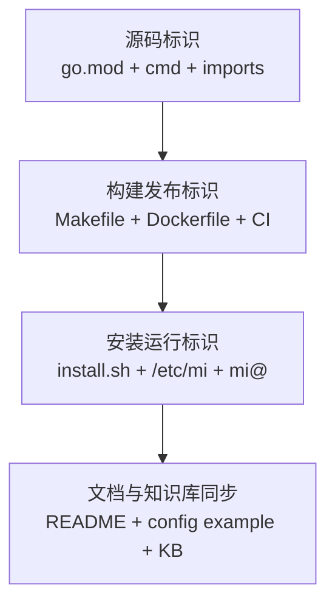

# 变更提案: mi-node-full-rename

## 元信息
```yaml
类型: 重构
方案类型: implementation
优先级: P0
状态: 已确认
创建: 2026-04-16
```

---

## 1. 需求

### 背景
当前仓库的品牌与运行标识全面绑定在 `xboard-node` / `Xboard-Node` 上，已经覆盖 Go module path、入口目录、编译产物、Docker 镜像、安装脚本、默认配置目录、systemd 服务名和 README 示例命令。用户要求把“总体项目名称和编译出来的文件以及一切运行脚本+镜像的名称”全部去掉 `xboard`，统一改成 `mi-node`。

### 目标
- 将仓内源码、构建、运行时与文档中的活动命名统一到 `mi-node`
- 消除 `xboard-node` 作为二进制名、镜像名、服务名、容器名、配置目录名的运行时残留
- 保持现有功能、测试和发布流程可继续工作

### 约束条件
```yaml
时间约束: 本轮直接完成实现与基础验证
性能约束: 不引入额外运行时开销，仅做命名与路径重构
兼容性约束: 仓库远端 slug 当前仍为 Micah123321/Xboard-Node，本轮不改 GitHub 仓库名
业务约束: 用户明确要求全量替换，不采用“仅展示名”或“仅运行时名”的保守方案
```

### 验收标准
- [x] Go module path、源码 import、入口目录、构建产物、Docker entrypoint、安装目录、systemd 服务名、容器名和 CI artifact 全部切换到 `mi-node`
- [x] `install.sh` 与 `README.md` 的安装、更新、排障示例不再使用 `xboard-node` 作为运行名；当前仓库 Raw / Release 源仍指向尚未改名的 `Xboard-Node`
- [x] `go test ./...`、当前平台构建与 Linux amd64/arm64 交叉编译通过，全文扫描仅保留当前实际仓库发布源 `Xboard-Node`

---

## 2. 方案

### 技术方案
采用“全量硬切到 `mi-node`”方案，一次性完成四类改动：

1. 源码与模块标识：调整 `go.mod` module path 到 `github.com/micah123321/mi-node`，同步所有内部 import、入口目录 `cmd/mi-node`、版本输出和日志里的程序名。
2. 构建与发布标识：调整 `Makefile`、`Dockerfile`、GitHub Actions 中的产物名、artifact 名、release 文件名和 Docker cache scope，使编译产物及镜像运行名统一为 `mi-node`。
3. 安装与运行时标识：调整 `install.sh` 中的安装目标、默认配置目录、systemd 模板名、容器名、镜像默认值、环境变量前缀以及所有运维提示。
4. 文档与示例：同步 `README.md`、`config.yml.example` 与知识库文档，确保安装命令、配置路径和故障排查命令全部切到 `mi`。

### 影响范围
```yaml
涉及模块:
  - bootstrap/cmd: 入口目录、版本输出、启动/停止日志
  - go module/import graph: module path 与 internal import 全量替换
  - build/release: Makefile、Dockerfile、.github/workflows/ci.yml
  - install/ops: install.sh、默认配置目录、systemd、容器命名、镜像默认值
  - docs/config: README.md、config.yml.example、.helloagents 文档
预计变更文件: 20+
```

### 风险评估
| 风险 | 等级 | 应对 |
|------|------|------|
| Go module path 改为 `github.com/micah123321/mi-node` 后，与当前 GitHub 仓库 slug `Xboard-Node` 暂时不一致 | 高 | 明确区分“源码模块路径”和“当前发布源仓名”；保证本仓自编译通过，并在 README / install.sh 中保留当前可用发布源 |
| 运行目录与服务名改动导致旧部署命令失效 | 中 | 同步 `install.sh`、README 与排障提示，确保新装路径一致 |
| 长文件 `install.sh` / `README.md` 在 Windows 下大补丁失败 | 中 | 按块 patch，按命名触点分批替换，避免整文件覆盖 |

---

## 3. 技术设计

### 架构设计


### 数据模型
| 字段 | 类型 | 说明 |
|------|------|------|
| rename_target | string | 统一目标命名，固定为 `mi-node` |
| binary_name | string | 新二进制名，固定为 `mi-node` |
| config_dir | string | 新默认配置目录，固定为 `/etc/mi-node` |

---

## 4. 核心场景

### 场景: 原生部署与运维
**模块**: install / ops
**条件**: 用户使用 `install.sh` 部署单节点或多节点
**行为**: 脚本下载/安装 `mi-node` 二进制，写入 `/etc/mi-node`，创建 `mi-node@<node_id>` 服务或 `mi-node-<node_id>` 容器
**结果**: 新部署和后续排障命令不再出现 `xboard-node` 作为运行时名称

### 场景: CI 构建与发布
**模块**: build / release
**条件**: GitHub Actions 触发测试、构建或发布
**行为**: workflow 产出 `mi-node-linux-amd64`、`mi-node-linux-arm64`，上传 artifact，并生成与 `mi-node` 对齐的 release 文件名和镜像构建缓存
**结果**: 编译与发布产物统一为 `mi-node`

---

## 5. 技术决策

### mi-full-rename#D001: 仓内标识全量硬切为 `mi-node`
**日期**: 2026-04-16
**状态**: ✅采纳
**背景**: 用户明确要求“全部”去掉 `xboard`，不仅是展示层，还包括编译文件、运行脚本和镜像名。
**选项分析**:
| 选项 | 优点 | 缺点 |
|------|------|------|
| A: 仓内全量硬切到 `mi-node` | 满足用户口径最完整，仓内命名一致性最高 | 与当前 GitHub 仓库 slug 暂时脱钩，变更面最大 |
| B: 仅运行时/展示层改名 | 发布风险更低 | 仓内会残留 `xboard`，不满足“全部去掉” |
**决策**: 选择方案 A
**理由**: 用户已明确确认全量替换，且本轮目标是品牌与运行标识的彻底收口，优先满足结果一致性。
**影响**: 影响源码路径、构建脚本、CI 发布链、安装脚本、运维命令与文档。

### mi-full-rename#D002: 保留当前发布源仓库 slug `Xboard-Node`，但源码模块路径切到 `mi-node`
**日期**: 2026-04-16
**状态**: ✅采纳
**背景**: 当前仓库远端仍为 `Micah123321/Xboard-Node`，但用户已经明确后续仓名会改成 `mi-node`，因此源码模块路径需要提前对齐到未来名称。
**选项分析**:
| 选项 | 优点 | 缺点 |
|------|------|------|
| A: 本轮同时改 GitHub 仓库名 | 对外完全统一 | 超出当前本地改造范围，需要远端管理权限和额外发布验证 |
| B: 本轮只改仓内命名，保留当前发布源仓名 | 能在当前仓内闭环完成实现与验证，同时让模块路径提前对齐未来仓名 | README / install.sh 中仍需保留当前真实发布源 |
**决策**: 选择方案 B
**理由**: 先完成仓内与产物侧的强一致命名，远端仓更名可作为后续独立操作处理。
**影响**: README / install 脚本中仍可能保留当前远端仓库地址，但运行产物与镜像名全部改为 `mi`。

---

## 6. 成果设计

N/A。本任务无视觉产出，目标是代码、脚本、产物和文档命名重构。
