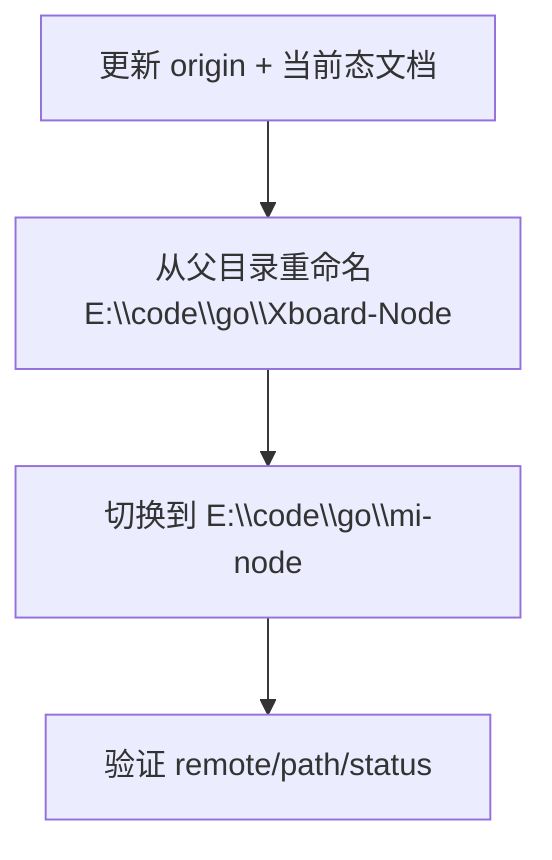

# 变更提案: repo-folder-rename-to-mi-node

## 元信息
```yaml
类型: 重构
方案类型: implementation
优先级: P0
状态: 已确认
创建: 2026-04-16
```

---

## 1. 需求

### 背景
上一轮已将源码模块路径、产物名、运行脚本和镜像名切换到 `mi-node`，但当时真实仓库 slug 与本地目录仍保留旧名。用户完成 GitHub 仓库更名后，本轮继续把仓库地址、本地文件夹和当前态文档一并收口到 `mi-node`。

### 目标
- 将 git remote 从旧仓地址切换到 `Micah123321/mi-node.git`
- 将本地目录从旧目录切换到 `E:\code\go\mi-node`
- 同步 README、install.sh 与 `.helloagents` 中当前态文档的仓库地址、Raw 地址和本地路径描述

### 约束条件
```yaml
时间约束: 本轮直接完成改名与验证
性能约束: 仅做仓名、目录名和文档路径调整，不引入运行逻辑变化
兼容性约束: 当前已有未提交改动，需要在目录改名过程中完整保留工作区状态
业务约束: 用户已明确要求“更改文件夹+更改文档+更改一切 xboard-node”，当前真实仓库地址为 https://github.com/Micah123321/mi-node
```

### 验收标准
- [x] `git remote -v` 指向 `https://github.com/Micah123321/mi-node.git`
- [x] 本地仓目录已切换到 `E:\code\go\mi-node` 且工作区改动完整保留
- [x] README、install.sh 和 `.helloagents` 当前态文档中的仓库地址、Raw 地址、本地路径已同步到 `mi-node`

---

## 2. 方案

### 技术方案
本轮按“先更新仓内引用，再改物理目录，最后在新路径下验证”的顺序执行：

1. 更新仓库源和文档：在旧路径内把 `origin`、README、install.sh、知识库上下文中的仓库 URL 与路径描述改为 `mi-node`。
2. 切换本地目录：从父目录 `E:\code\go` 执行迁移，将旧目录内容整体切换到 `E:\code\go\mi-node`，规避当前工作目录占用导致的根目录重命名失败。
3. 新路径验证：在 `E:\code\go\mi-node` 下确认 remote、目录、README/install 文档和 git 工作区状态正确。

### 影响范围
```yaml
涉及模块:
  - git metadata: origin remote URL
  - docs/install: README.md, install.sh
  - knowledge base: .helloagents/context.md, CHANGELOG.md, 归档方案中的当前态说明
  - local workspace: 仓库根目录物理路径
预计变更文件: 8+
```

### 风险评估
| 风险 | 等级 | 应对 |
|------|------|------|
| 当前目录被 CLI 占用导致 Windows 下根目录重命名失败 | 高 | 从父目录执行内容迁移切换到新路径，旧空壳目录最后清理 |
| `.helloagents` 中历史方案包仍保留旧路径/旧仓名，和当前状态混杂 | 中 | 优先修正当前态文档与刚完成的重命名方案包；历史归档保持可追溯，不做整库历史改写 |
| git remote 未同步导致 README/install 与真实发布源不一致 | 中 | 先改 remote，再统一 README/install 默认地址与 Raw 地址 |

---

## 3. 技术设计

### 架构设计


### 数据模型
| 字段 | 类型 | 说明 |
|------|------|------|
| old_repo | string | 旧仓地址 |
| new_repo | string | `Micah123321/mi-node` |
| old_path | string | 旧本地目录 |
| new_path | string | `E:\code\go\mi-node` |

---

## 4. 核心场景

### 场景: 更新发布源与本地路径
**模块**: repo / docs / kb
**条件**: GitHub 仓库已更名为 `mi-node`
**行为**: 更新 `origin`、README Raw 地址、install 默认发布源、本地仓目录和知识库路径说明
**结果**: 当前开发、安装和文档入口统一指向 `mi-node`

---

## 5. 技术决策

### repo-folder-rename-to-mi-node#D001: 立即同步本地目录与发布源到 `mi-node`
**日期**: 2026-04-16
**状态**: ✅采纳
**背景**: 用户已完成远端仓库更名，并要求继续把文件夹、文档和一切当前态入口同步到新名称。
**选项分析**:
| 选项 | 优点 | 缺点 |
|------|------|------|
| A: 现在直接改 remote + 目录 + 文档 | 当前态统一最快，后续不再需要兼容旧仓名 | 需要处理 Windows 下目录重命名的路径切换 |
| B: 只改 remote 和文档，目录以后再改 | 风险更低 | 本地路径仍与仓名不一致，继续制造混淆 |
**决策**: 选择方案 A
**理由**: 用户已明确选择“现在直接改名”，且当前远端仓名已就位，继续保留旧目录没有价值。
**影响**: 影响 git remote、本地工作目录、README/install 地址和知识库上下文。

---

## 6. 成果设计

N/A。本任务无视觉产出。
