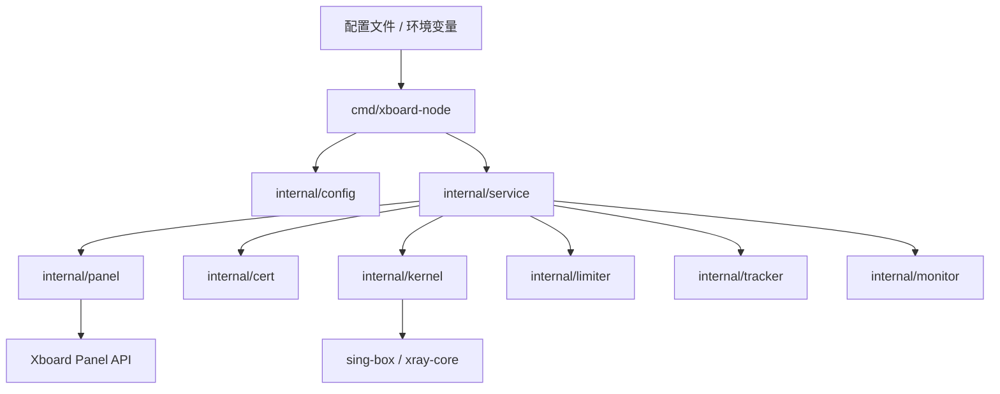
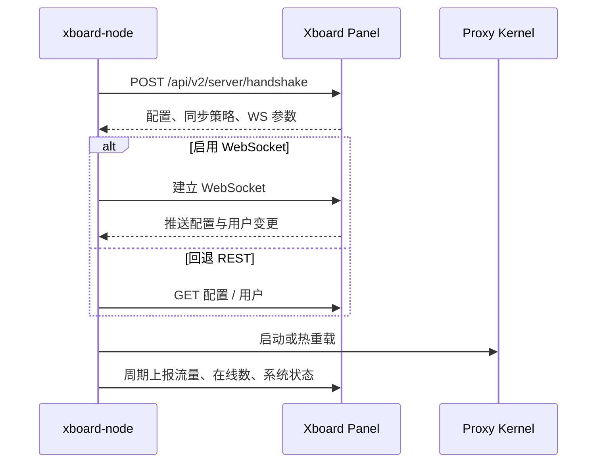

# 架构设计

## 总体架构

## 技术栈
- **后端:** Go 1.25.x
- **通信:** HTTP、WebSocket
- **运行形态:** 单二进制、`systemd` 服务、Docker 容器

## 核心流程

## 重大架构决策
完整 ADR 记录存储在各变更方案的 `how.md` 中，本章节提供索引。

| adr_id | title | date | status | affected_modules | details |
|--------|-------|------|--------|------------------|---------|
| ADR-20260320-01 | 文档默认推荐原生部署而非 Docker | 2026-03-20 | ✅已采纳 | 安装部署、配置系统 | [history/2026-03/202603200133_docs_cn_native_deploy/how.md#adr-20260320-01-文档默认推荐原生部署而非-docker](../history/2026-03/202603200133_docs_cn_native_deploy/how.md#adr-20260320-01-文档默认推荐原生部署而非-docker) |